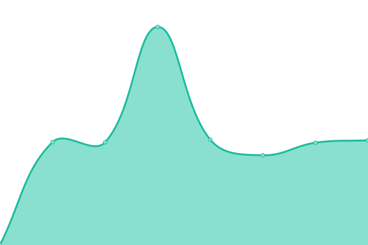
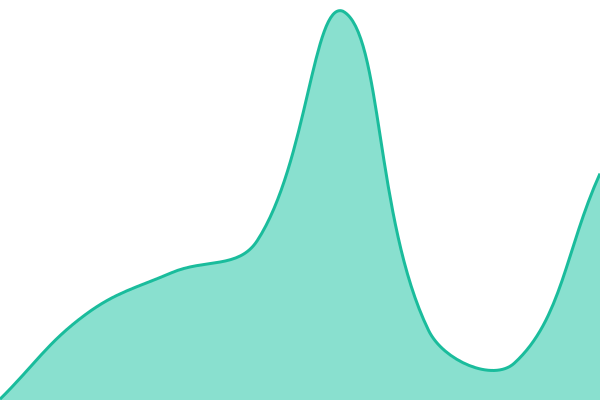
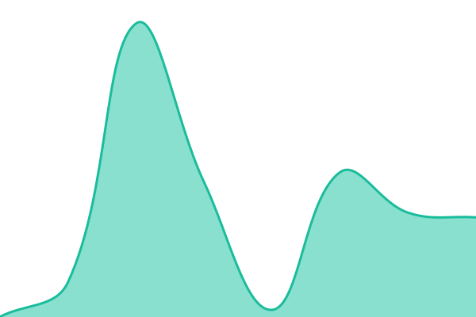
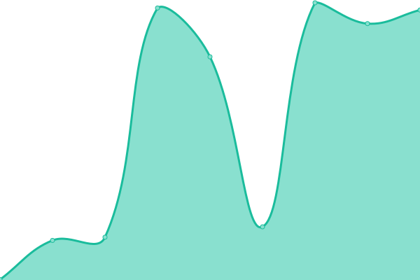

# [📈 Live Status](https://dev.ligny.org/upptime): <!--live status--> **🟩 All systems operational**

This repository contains the open-source uptime monitor and status page for [Arnaud Ligny](https://arnaudligny.fr), powered by [Upptime](https://github.com/upptime/upptime).

With [Upptime](https://upptime.js.org), you can get your own unlimited and free uptime monitor and status page, powered entirely by a GitHub repository. We use [Issues](https://github.com/ArnaudLigny/upptime/issues) as incident reports, [Actions](https://github.com/ArnaudLigny/upptime/actions) as uptime monitors, and [Pages](https://dev.ligny.org/upptime) for the status page.

<!--start: status pages-->
<!-- This summary is generated by Upptime (https://github.com/upptime/upptime) -->
<!-- Do not edit this manually, your changes will be overwritten -->
<!-- prettier-ignore -->
| URL | Status | History | Response Time | Uptime |
| --- | ------ | ------- | ------------- | ------ |
|  [Arnaud Ligny](https://arnaudligny.fr) | 🟩 Up | [arnaud-ligny.yml](https://github.com/ArnaudLigny/upptime/commits/HEAD/history/arnaud-ligny.yml) | 

 725ms
     
 | 

<a href="https://dev.ligny.org/history/arnaud-ligny">100.00%</a>
    

|  [Ligny](https://ligny.fr) | 🟩 Up | [ligny.yml](https://github.com/ArnaudLigny/upptime/commits/HEAD/history/ligny.yml) | 

 700ms
     
 | 

<a href="https://dev.ligny.org/history/ligny">100.00%</a>
    

|  [Cecil](https://cecil.app) | 🟩 Up | [cecil.yml](https://github.com/ArnaudLigny/upptime/commits/HEAD/history/cecil.yml) | 

 304ms
     
 | 

<a href="https://dev.ligny.org/history/cecil">100.00%</a>
    

|  [Jamstatic](https://jamstatic.fr) | 🟩 Up | [jamstatic.yml](https://github.com/ArnaudLigny/upptime/commits/HEAD/history/jamstatic.yml) | 

 254ms
     
 | 

<a href="https://dev.ligny.org/history/jamstatic">100.00%</a>
    

|  [Cecillie](https://www.cecillie.fr) | 🟩 Up | [cecillie.yml](https://github.com/ArnaudLigny/upptime/commits/HEAD/history/cecillie.yml) | 

 588ms
     
 | 

<a href="https://dev.ligny.org/history/cecillie">100.00%</a>
    

|  [Les aventures de Jean Claude](https://jeanclaude-aventures.com) | 🟩 Up | [les-aventures-de-jean-claude.yml](https://github.com/ArnaudLigny/upptime/commits/HEAD/history/les-aventures-de-jean-claude.yml) | 

 732ms
     
 | 

<a href="https://dev.ligny.org/history/les-aventures-de-jean-claude">100.00%</a>
    

|  [Le sac à dos infini](https://jeanclaude-sac.netlify.app) | 🟩 Up | [le-sac-a-dos-infini.yml](https://github.com/ArnaudLigny/upptime/commits/HEAD/history/le-sac-a-dos-infini.yml) | 

 499ms
     
 | 

<a href="https://dev.ligny.org/history/le-sac-a-dos-infini">100.00%</a>
    

<!--end: status pages-->

[**Visit our status website →**](https://dev.ligny.org/upptime)

## 📄 License

- Powered by: [Upptime](https://github.com/upptime/upptime)
- Code: [MIT](./LICENSE) © [Arnaud Ligny](https://arnaudligny.fr)
- Data in the `./history` directory: [Open Database License](https://opendatacommons.org/licenses/odbl/1-0/)
