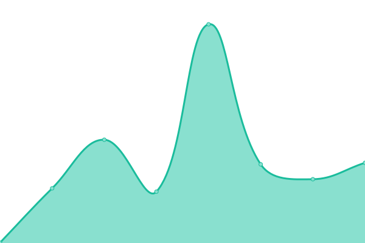
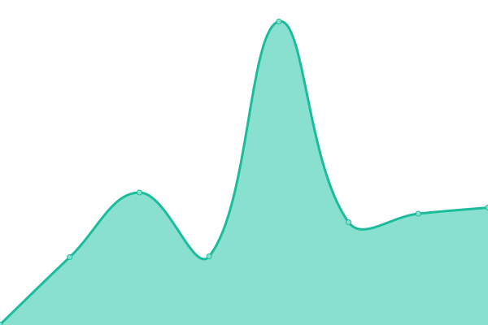

# [📈 Live Status](https://dev.ligny.org/upptime): <!--live status--> **🟧 Partial outage**

This repository contains the open-source uptime monitor and status page for [Arnaud Ligny](https://arnaudligny.fr), powered by [Upptime](https://github.com/upptime/upptime).

With [Upptime](https://upptime.js.org), you can get your own unlimited and free uptime monitor and status page, powered entirely by a GitHub repository. We use [Issues](https://github.com/ArnaudLigny/upptime/issues) as incident reports, [Actions](https://github.com/ArnaudLigny/upptime/actions) as uptime monitors, and [Pages](https://dev.ligny.org/upptime) for the status page.

<!--start: status pages-->
<!-- This summary is generated by Upptime (https://github.com/upptime/upptime) -->
<!-- Do not edit this manually, your changes will be overwritten -->
<!-- prettier-ignore -->
| URL | Status | History | Response Time | Uptime |
| --- | ------ | ------- | ------------- | ------ |
|  [ArnaudLigny.fr](https://arnaudligny.fr) | 🟩 Up | [arnaud-ligny-fr.yml](https://github.com/ArnaudLigny/upptime/commits/HEAD/history/arnaud-ligny-fr.yml) | 

 771ms
     
 | 

<a href="https://dev.ligny.org/history/arnaud-ligny-fr">100.00%</a>
    

|  [Ligny.fr](https://ligny.fr) | 🟩 Up | [ligny-fr.yml](https://github.com/ArnaudLigny/upptime/commits/HEAD/history/ligny-fr.yml) | 

 778ms
     
 | 

<a href="https://dev.ligny.org/history/ligny-fr">100.00%</a>
    

|  [Cecil.app](https://cecil.app) | 🟩 Up | [cecil-app.yml](https://github.com/ArnaudLigny/upptime/commits/HEAD/history/cecil-app.yml) | 

 430ms
     
 | 

<a href="https://dev.ligny.org/history/cecil-app">100.00%</a>
    

|  [Jamstatic.fr](https://jamstatic.fr) | 🟩 Up | [jamstatic-fr.yml](https://github.com/ArnaudLigny/upptime/commits/HEAD/history/jamstatic-fr.yml) | 

 332ms
     
 | 

<a href="https://dev.ligny.org/history/jamstatic-fr">100.00%</a>
    

|  [Cecillie.fr](https://www.cecillie.fr) | 🟩 Up | [cecillie-fr.yml](https://github.com/ArnaudLigny/upptime/commits/HEAD/history/cecillie-fr.yml) | 

 390ms
     
 | 

<a href="https://dev.ligny.org/history/cecillie-fr">100.00%</a>
    

|  [Paysages à vélo](https://shop.cecillie.fr) | 🟥 Down | [paysages-a-velo.yml](https://github.com/ArnaudLigny/upptime/commits/HEAD/history/paysages-a-velo.yml) | 

 756ms
     
 | 

<a href="https://dev.ligny.org/history/paysages-a-velo">99.51%</a>
    

|  [Narno.com](https://narno.com) | 🟩 Up | [narno-com.yml](https://github.com/ArnaudLigny/upptime/commits/HEAD/history/narno-com.yml) | 

 287ms
     
 | 

<a href="https://dev.ligny.org/history/narno-com">100.00%</a>
    

<!--end: status pages-->

[**Visit our status website →**](https://dev.ligny.org/upptime)

## 📄 License

- Powered by: [Upptime](https://github.com/upptime/upptime)
- Code: [MIT](./LICENSE) © [Arnaud Ligny](https://arnaudligny.fr)
- Data in the `./history` directory: [Open Database License](https://opendatacommons.org/licenses/odbl/1-0/)
